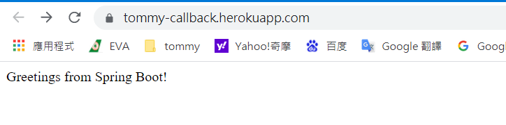

# need fix R10 ERROR
```shell
2022-04-06T08:27:04.535510+00:00 app[web.1]: 2022-04-06 08:27:04.535  INFO 3 --- [           main] org.apache.catalina.core.StandardEngine  : Starting Servlet engine: [Apache Tomcat/9.0.48]
2022-04-06T08:27:04.592832+00:00 app[web.1]: 2022-04-06 08:27:04.592  INFO 3 --- [           main] o.a.c.c.C.[Tomcat].[localhost].[/]       : Initializing Spring embedded WebApplicationContext
2022-04-06T08:27:04.592960+00:00 app[web.1]: 2022-04-06 08:27:04.592  INFO 3 --- [           main] w.s.c.ServletWebServerApplicationContext : Root WebApplicationContext: initialization completed in 1309 ms
2022-04-06T08:27:05.144862+00:00 app[web.1]: 2022-04-06 08:27:05.144  INFO 3 --- [           main] o.s.b.w.embedded.tomcat.TomcatWebServer  : Tomcat started on port(s): 8080 (http) with context path ''
2022-04-06T08:27:05.160692+00:00 app[web.1]: 2022-04-06 08:27:05.160  INFO 3 --- [           main] com.tommy.App                            : Started App in 2.641 seconds (JVM running for 3.175)
2022-04-06T08:29:31.291954+00:00 heroku[web.1]: Error R10 (Boot timeout) -> Web process failed to bind to $PORT within 150 seconds of launch
2022-04-06T08:29:31.379274+00:00 heroku[web.1]: Stopping process with SIGKILL
2022-04-06T08:29:31.546416+00:00 heroku[web.1]: Process exited with status 137
2022-04-06T08:29:31.612494+00:00 heroku[web.1]: State changed from starting to crashed
```


===============================
1. https://devcenter.heroku.com/articles/procfile


# callback response

## success

```http request
POST https://yudady-callback.herokuapp.com/success
Content-Type: application/json

{
  "result": "SUCCESS",
  "app": "heroku"
}
```

## fail

```http request
POST https://yudady-callback.herokuapp.com/fail
Content-Type: application/json

{
  "result": "fail",
  "app": "heroku"
}
```

### signature

```http request
POST https://yudady-callback.herokuapp.com/signature
Content-Type: application/json

{
"key": "13653cb1-1cf5-4c43-b123-611dd8f720d7",
"contentType": "application/json; charset=utf-8",
"keyId": "bc4d3b07-e8b4-4ed0-97f8-7fc188b7b12e",
"body": "{\"deviceType\":\"WEB\",\"identity\": \"depositTommyTest0000000001\"}"
}
```

## about Heroku

Install the Heroku CLI Download and install the Heroku CLI.

If you haven't already, log in to your Heroku account and follow the prompts to create a new SSH public key.

```shell
$ heroku login
```

Create a new Git repository Initialize a git repository in a new or existing directory

```shell
$ cd my-project/
$ git init
$ heroku git:remote -a yudady-callback
```

Deploy your application Commit your code to the repository and deploy it to Heroku using Git.

```shell
$ git add .
$ git commit -am "make it better"
$ git push heroku master
```


https://yudady-callback.herokuapp.com/



## change code

```shell
$ heroku login
$ git push heroku master
```


[deploy-the-app](https://devcenter.heroku.com/articles/getting-started-with-java#deploy-the-app)

[如何在 Heroku 上架設免費的 Java 空間](https://www.gss.com.tw/blog/heroku-java-free-space)


## create heroku project


## rename heroku project 


## add heroku project git


## heroku project log
> heroku logs


## youtube

[](https://www.youtube.com/watch?v=KDK5xXPJVIg)


========================

## github action

### HEROKU_API_KEY


### docker
[Heroku Docker Deploy - GitHub Action](https://github.com/marketplace/actions/build-push-and-release-a-docker-container-to-heroku?version=v1.3.3)


##
add ACCESS_TOKEN


```yaml
# This workflow will build a package using Maven and then publish it to GitHub packages when a release is created
# For more information see: https://github.com/actions/setup-java#apache-maven-with-a-settings-path

name: Maven Package

on:
  push:
    branches: [main]
  release:
    types: [created]

jobs:
  build:

    runs-on: ubuntu-latest
    steps:
    - uses: actions/checkout@v3
    - name: Set up JDK 17
      uses: actions/setup-java@v3
      with:
        java-version: '17'
        distribution: 'temurin'
        server-id: github # Value of the distributionManagement/repository/id field of the pom.xml
        settings-path: ${{ github.workspace }} # location for the settings.xml file

    - name: Build with Maven
      run: mvn -B package --file pom.xml

    - name: Publish to GitHub Packages Apache Maven
      run: mvn deploy -s $GITHUB_WORKSPACE/settings.xml
      env:
        GITHUB_TOKEN: ${{ secrets.ACCESS_TOKEN }}


```


###
pom.xml

```xml
	<repositories>
		<repository>
			<id>github</id>
			<!-- https://raw.github.com/使用者名稱/倉庫名/分支名 -->
			<url>https://maven.pkg.github.com/yudady/tommy-heroku-springboot-docker</url>
			<releases>
				<enabled>true</enabled>
			</releases>
			<snapshots>
				<enabled>true</enabled>
			</snapshots>
		</repository>
	</repositories>
	<dependencies>
		<dependency>
			<groupId>io.github.yudady</groupId>
			<artifactId>tommy-heroku-springboot-docker</artifactId>
			<version>0.0.1-SNAPSHOT</version>
		</dependency>
	</dependencies>
```

~/.m2/settings.xml

```xml
<servers>
        <server>
            <id>github</id>
            <username>yudady</username>
            <password>ghp_XXXXXXXXXXXXXXXXXXXXXX</password>
        </server>
  </servers>
```

