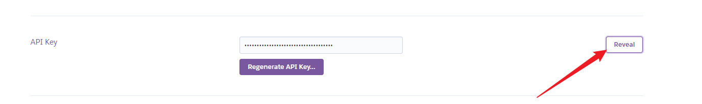

# callback response

## success

```http request
POST https://yudady-callback.herokuapp.com/success
Content-Type: application/json

{
  "result": "SUCCESS",
  "app": "heroku"
}
```

## fail

```http request
POST https://yudady-callback.herokuapp.com/fail
Content-Type: application/json

{
  "result": "fail",
  "app": "heroku"
}
```

### signature

```http request
POST https://yudady-callback.herokuapp.com/signature
Content-Type: application/json

{
"key": "13653cb1-1cf5-4c43-b123-611dd8f720d7",
"contentType": "application/json; charset=utf-8",
"keyId": "bc4d3b07-e8b4-4ed0-97f8-7fc188b7b12e",
"body": "{\"deviceType\":\"WEB\",\"identity\": \"depositTommyTest0000000001\"}"
}
```

## about Heroku

Install the Heroku CLI Download and install the Heroku CLI.

If you haven't already, log in to your Heroku account and follow the prompts to create a new SSH public key.

```shell
$ heroku login
```

Create a new Git repository Initialize a git repository in a new or existing directory

```shell
$ cd my-project/
$ git init
$ heroku git:remote -a yudady-callback
```

Deploy your application Commit your code to the repository and deploy it to Heroku using Git.

```shell
$ git add .
$ git commit -am "make it better"
$ git push heroku master
```


https://yudady-callback.herokuapp.com/


## change code

```shell
$ heroku login
$ git push heroku master
```


[deploy-the-app](https://devcenter.heroku.com/articles/getting-started-with-java#deploy-the-app)

[如何在 Heroku 上架設免費的 Java 空間](https://www.gss.com.tw/blog/heroku-java-free-space)


## create heroku project


## rename heroku project 


## add heroku project git


## heroku project log
> heroku logs


## youtube

[](https://www.youtube.com/watch?v=KDK5xXPJVIg)


========================

## github action

### HEROKU_API_KEY


### docker
[Heroku Docker Deploy - GitHub Action](https://github.com/marketplace/actions/build-push-and-release-a-docker-container-to-heroku?version=v1.3.3)


